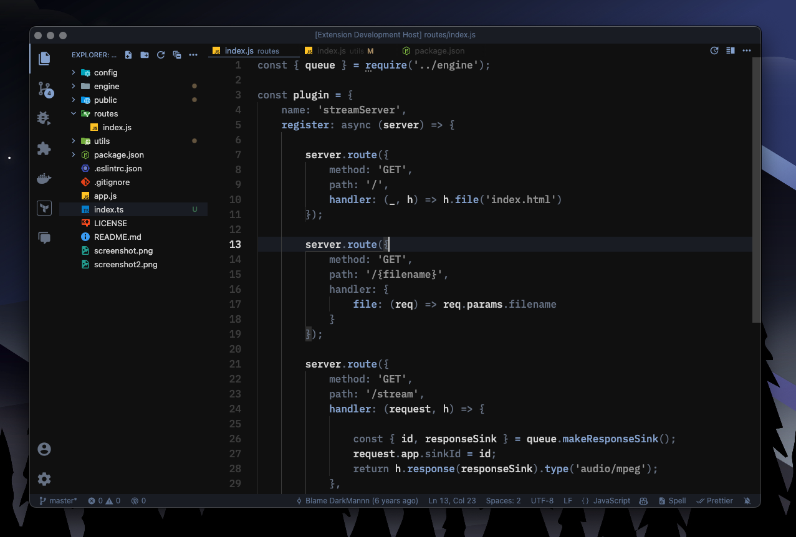

# Dark Ink Theme

Dark, minimalistic VSCode theme with eye-soothing, gentle shades of ink.

After the latest release there are multiple variants of dark themes, and a single matching light theme just in case anyone needs it.

Enjoy!! 🙂

## Installation

1. Open the **Extensions** sidebar in VS Code. `View → Extensions`
1. Search for `Dark Ink Theme`, choose "Dark Ink Theme" by **DarkMannn**
1. Click **Install** to install it
1. Navigate to File > Preferences > Color Theme > **Dark Ink Theme**

## Contributing

Please report any issues [here](https://github.com/DarkMannn/dark-ink-vscode-theme/issues).

## License

This theme is released under the [MIT License](https://github.com/DarkMannn/dark-ink-vscode-theme/blob/main/LICENSE.md).

## Author

✨ Designed by **[DarkMannn](https://darkmannn.dev)**
